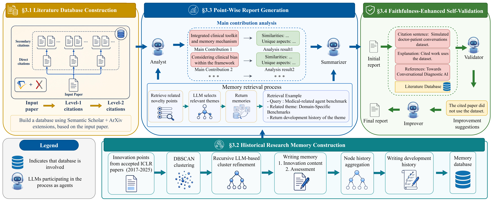
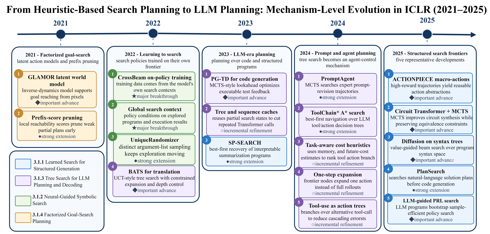
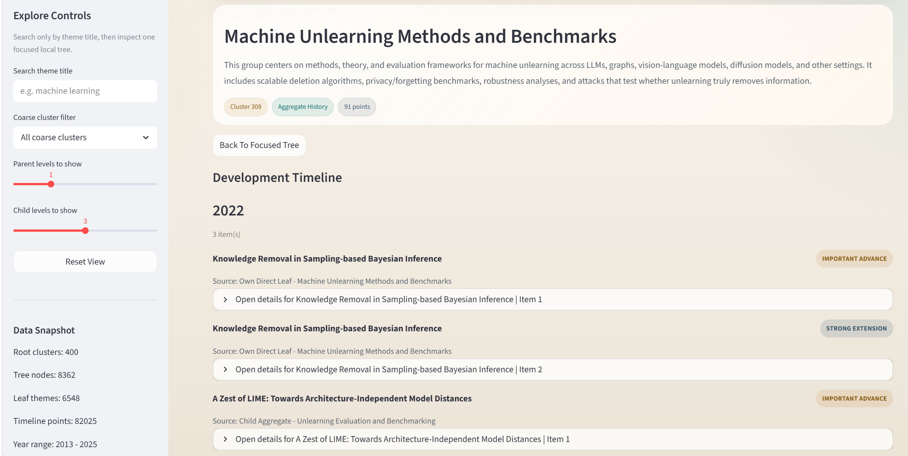

# MemoNoveltyAgent

MemoNoveltyAgent is the codebase for our paper:

> **MemoNoveltyAgent: A Historical Research Memory-Aware Agent Workflow for Paper Novelty Assessment**

MemoNoveltyAgent is built to help researchers quickly understand **how novel a paper really is**. Instead of only producing a generic paper summary, it breaks a paper into concrete novelty points, searches the related literature, retrieves historical research memory, and generates a structured report that explains what is genuinely new, what is similar to prior work, and where the contribution may be incremental.

If you find this project useful, please consider giving us a **star**. It helps others discover the project and motivates continued development.

## Overview



The figure above shows the full MemoNoveltyAgent workflow. Given a paper title, the system automatically crawls the target paper and related papers, builds a full-text literature database, extracts point-wise novelty claims, retrieves both local evidence and historical memory, and finally writes a faithful novelty report with self-validation.

Compared with general-purpose deep research tools or automated reviewer systems, MemoNoveltyAgent is designed specifically for novelty assessment. This makes it more useful when the goal is not simply to summarize a paper, but to judge whether each claimed contribution is actually new when compared with prior work.

## Why MemoNoveltyAgent?

MemoNoveltyAgent has four main strengths:

- **Point-wise novelty analysis**: It does not treat the whole paper as one vague query. Instead, it extracts individual novelty points and analyzes each one separately, making the final report more complete and easier to inspect.
- **Historical research memory**: It uses a memory database of historical innovation points, development trajectories, and reviewer-informed novelty judgments. This helps the agent recognize older ideas even when terminology changes across time.
- **Faithfulness-oriented self-validation**: It checks citation-bearing claims against source materials and revises unsupported statements, reducing hallucination and improving reliability.

## Historical Research Memory



The figure above shows an example branch from the historical research memory. This memory is more than a retrieval index: it organizes historical innovation points into interpretable theme trees and development trajectories. During report generation, MemoNoveltyAgent can use this memory to calibrate whether a new paper is making a major contribution, combining existing ideas, or applying a known technique to a new domain.

The memory website can also be used independently. It lets users browse the memory tree directly and inspect how a research direction evolves across related papers.

The bundled memory files are stored under `memory_database/`. Because these files are large, Git LFS is recommended when publishing or cloning the repository.

## Demo
https://github.com/user-attachments/assets/89c18aa2-4809-4256-8336-4d0ed74844e1
We provide a short demo video to illustrate the usage of the system:


> **Note:** This demo is for demonstration purposes only. In real-world usage, the analysis process takes longer than shown in the video, as it involves extensive literature crawling, retrieval, comparison, and validation.

## Installation & Setup

### Prerequisites

- Python 3.9+
- Docker & Docker Compose
- Git
- NVIDIA GPU with CUDA support is recommended for RAGFlow GPU mode, reranker inference, and memory embedding retrieval

### Step 1: Clone the Repository

```bash
git clone <your-repository-url>
cd MemoNoveltyAgent
```

If the repository is published with Git LFS, pull the large memory files with:

```bash
git lfs install
git lfs pull
```

### Step 2: Install Python Dependencies

```bash
pip install -r requirements.txt
```

### Step 3: Download the Reranker Model

Download the **Qwen3-Reranker-4B** model from HuggingFace using `huggingface_hub`:

```bash
python -c "
from huggingface_hub import snapshot_download
snapshot_download(
    repo_id='dengcao/Qwen3-Reranker-4B',
    local_dir='./dengcao/Qwen3-Reranker-4B'
)
"
```

### Step 4: Deploy RAGFlow

#### 4.1 Check and Configure `vm.max_map_count`

Elasticsearch requires `vm.max_map_count` to be at least **262144**. Check the current value:

```bash
sysctl vm.max_map_count
```

If the value is less than 262144, update it:

```bash
sudo sysctl -w vm.max_map_count=262144
```

To make this change permanent, add or update the following line in `/etc/sysctl.conf`:

```text
vm.max_map_count=262144
```

#### 4.2 Clone RAGFlow

```bash
git clone https://github.com/infiniflow/ragflow.git
```

#### 4.3 Replace Configuration Files

Replace RAGFlow's default `.env` and `docker-compose-base.yml` with the customized versions provided in this project's `Setup/` directory:

```bash
cp Setup/.env ragflow/docker/.env
cp Setup/docker-compose-base.yml ragflow/docker/docker-compose-base.yml
```

### Step 5: Start Docker Services

#### 5.1 Start RAGFlow

```bash
cd ragflow/docker
docker compose -f docker-compose-gpu.yml up -d
cd ../..
```

#### 5.2 Start the Reranker Service

```bash
cd dengcao/Qwen3-Reranker-4B
docker compose up -d
cd ../..
```

### Step 6: Configure the Reranker in RAGFlow

After both Docker services are up and running, manually register the reranker model inside RAGFlow's web UI:

1. Open `http://localhost:9380`.
2. Log in to the RAGFlow admin panel.
3. Go to **Model Providers** settings.
4. Add a new **Rerank model** with the model name `Qwen3-Reranker-4B`.
5. Point the model URL to the reranker service endpoint launched in Step 5.2.
6. Save the configuration.

### Step 7: Configure API Keys

Before running the system, configure the required OpenAI-compatible endpoint and RAGFlow settings. You can edit:

```text
MemoNoveltyAgent/config.json
```

or copy the environment template:

```bash
cp .env.example .env
```

No API keys are included in this repository.

### Step 8: Launch the Main Application

Start the Streamlit frontend from the project root:

```bash
streamlit run MemoNoveltyAgent/app.py --server.port 8501 --server.address 0.0.0.0
```

The application will be available by default at:

```text
http://localhost:8501
```

Enter a paper title in the sidebar and run the analysis. The system will automatically crawl or reuse the local paper database, build the RAGFlow dataset, retrieve historical memory, and generate the final report.

## Memory Website

The memory website provides an interactive interface for exploring the historical research memory. Users can search by theme title, focus on a local tree, inspect parent and child levels, and browse development timelines with concrete historical innovation records.



Start the standalone memory visualization website from the project root:

```bash
streamlit run Construct_memory/visualize_memory_web.py --server.port 8502 --server.address 0.0.0.0
```

The memory website will be available at:

```text
http://localhost:8502
```

Use this website to inspect historical research themes, development trajectories, and the memory evidence used by the report-generation agents.
